# EDCK 4001 Custom Devkit
## Overview

The new EDCK 4001 Custom Devkit is a Development Kit for Everyware Cloud that provides a learning enviroment and a testbed for IoT/M2M applications; 
it targets professional developers with an Embedded, IT or OT background. 

The kit is composed by: 

1. A ReliaGATE 10-11 Gateway.

2. Power supply

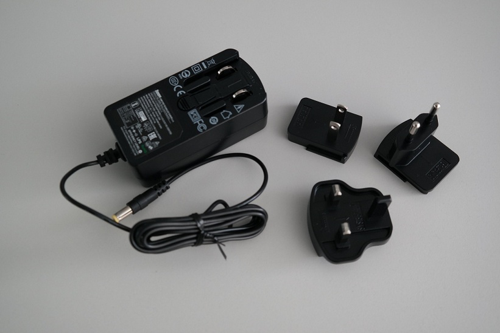

3. A Demo Board

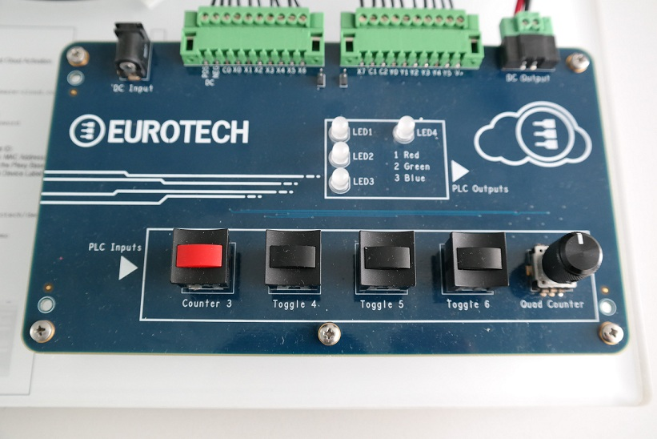

4. A PLC

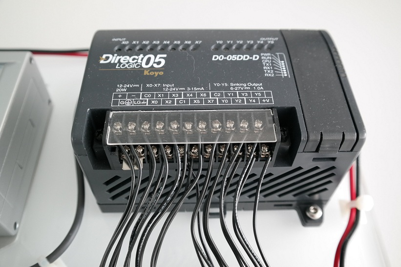

Before powering up the DevKit, please verify that the serial connector from the Gateway to the PLC is plugged in the PLC **Port 2** and the switch is set to **RUN**, as depicted in the following image:

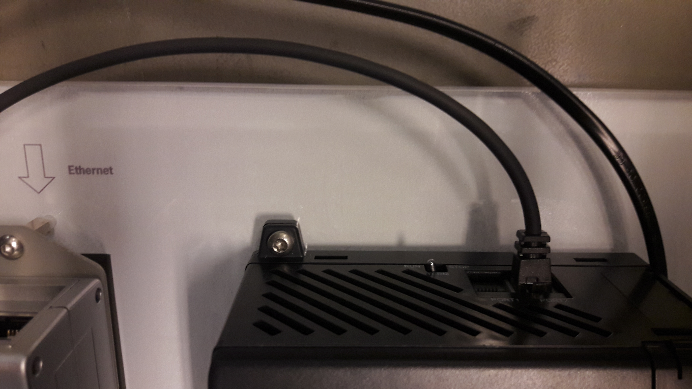

## Gateway Configuration
The Gateway configuration requires the following steps:
1. Install the latest version of ESF. You can download it from [here](http://www.eurotech.com/download/en/pb.aspx?pg=ESF)
2. Install the Eurotech Modbus Driver. It is available at the following [link](https://marketplace.eclipse.org/content/esf-modbus-driver). 
When installed, the ESF local Configuration UI should look like this:
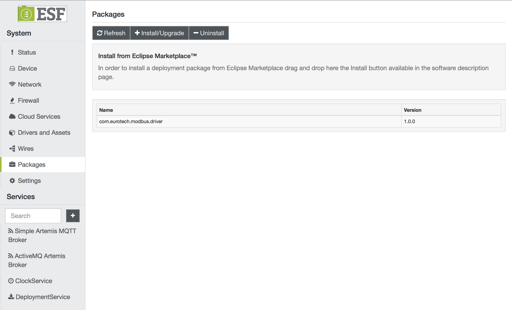

3. In the ESF Administrative Web UI, create a new driver instance:
    - Under **Drivers and Assets**, click the **New Driver** button
    - Select **org.eclipse.kura.driver.modbus**, type in a name, and click **Apply**: a new service will show up in the **Drivers and Assets** table.
   A new Driver instance will appear:
   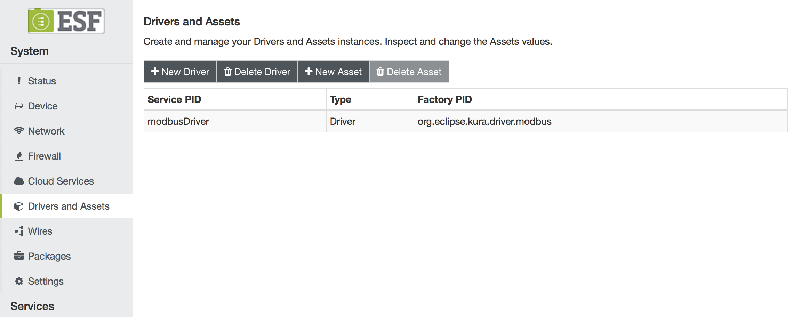
4. Configure the new service as follows:
    - **access.type**: RTU
    - **modbus.rtu.port.name**: The Serial Port to connect to. Usually set to **/dev/ttyO4**
    - **modbus.rtu.parity**: Set it to **ODD_PARITY**
    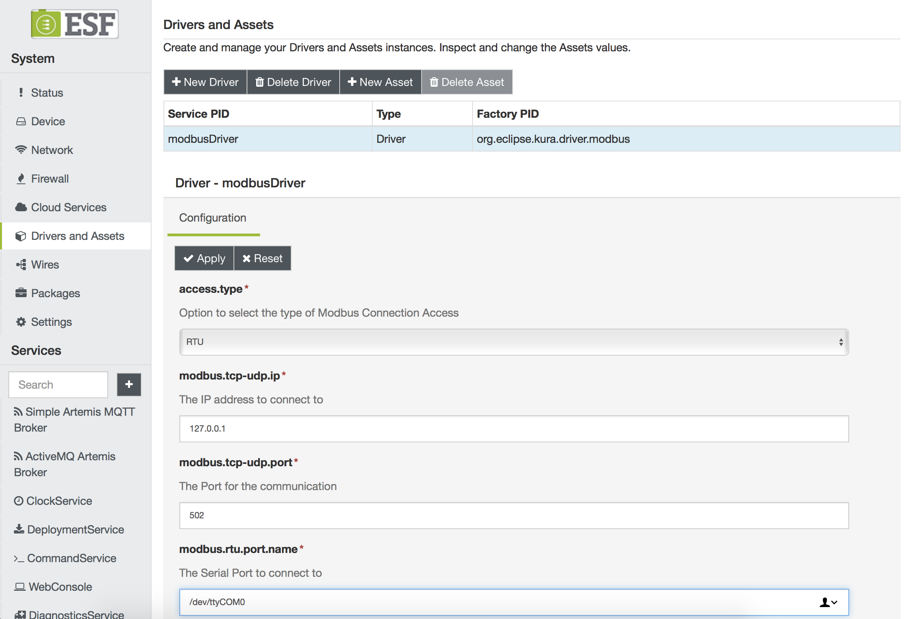
5. Click on **Wires** in **System**
6. Add a new **Timer** component and configure the interval at which the Modbus slave will be sampled
7. Add a new **Asset** with the previously added Modbus driver
8. Configure the new Modbus asset, adding the following channels:
   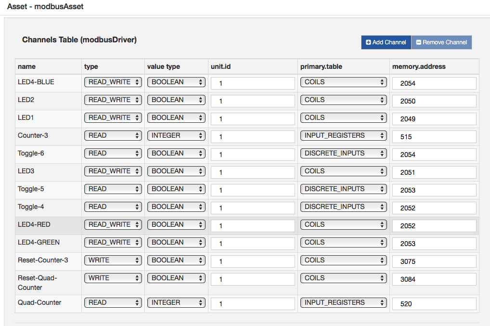
9. Add a new **Publisher** component and configure the chosen cloud platform stack in **cloud.service.pid** option
10. Add a **Logger** component
11. Connect the **Timer** to the **Asset**, and the **Asset** to the **Publisher** and **Logger**.
12. Click on **Apply** and check the logs and cloud platform that the data is correctly published.
    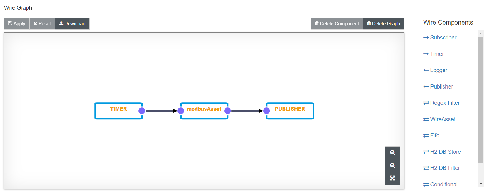

## Pre-Configured Snapshot
A snapshot is available [here](Snapshots/snapshot_EDCK4001.xml) 
When loaded, creates the all the drivers, assets and the needed wire graph for this example.
A pre-requisite is to have the modbus dp installed from the Eclipse Marketplace.

## Hosted Dashboard
The IoT Dev Kit Dashboard is available in hosted version at the following URL: https://devkit-wires.everyware-cloud.com

## How to use
When accessing to the dashboard locally or from the remote hosted version, the user will be prompted to login specifying:

- username;
- password;
- client id;
- asset name.

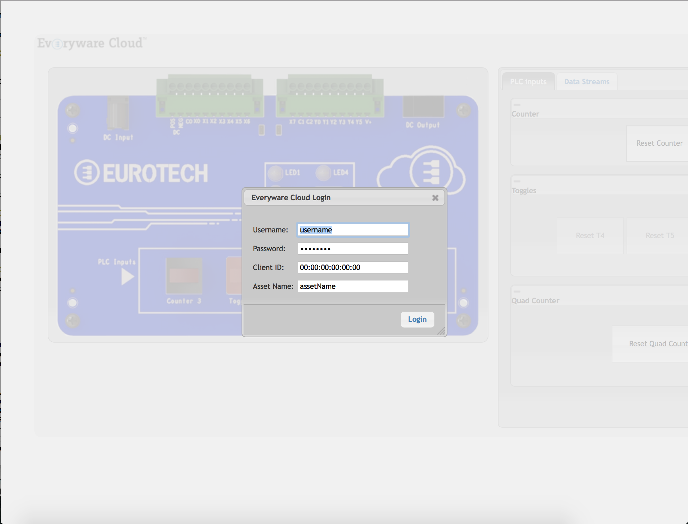

After setting the proper data, by clicking the `login` button, 

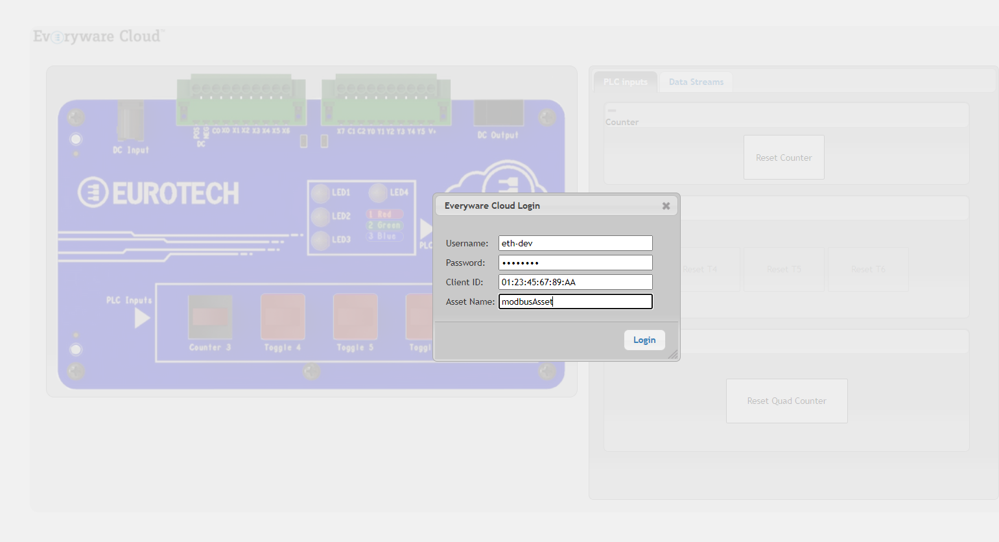

the user will be redirected to the DevKit dashboard.

The PLC Inputs are connected to Everyware Cloud Sandbox instance using Web Sockets. They change their state depending on the user interaction with the 
PLC Toggles and Counters.

The LEDs displayed in the middle of the dashboard allow to perform an interaction from the dashboard to the real LEDs of the DevKit.
When the user clicks on the Dashboard LEDs a REST API call is performed determining a request to the gateway and the real corresponding LED to light up.

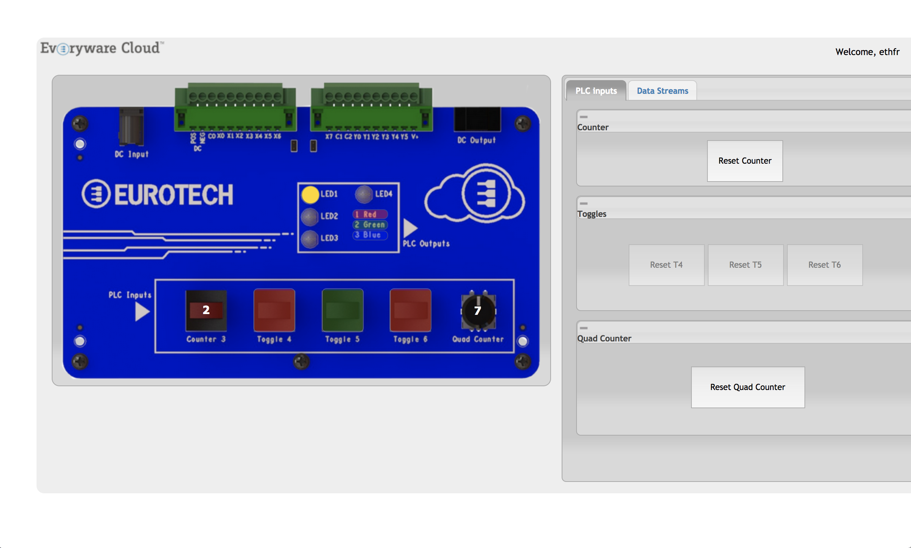

### Supported browsers
The dashboard works with Google Chrome and Mozilla Firefox.
The dashboard is also compatible with Apple Safari, but it needs the user to select the `Disable Local File Restrictions` option in the Develop menu.
