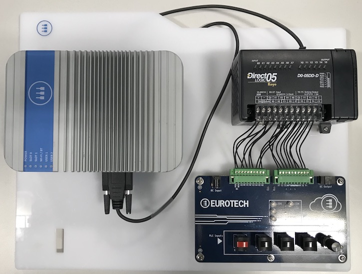

# EDCK 4001 
## Overview

The EDCK 4001 is a Development Kit for Everyware IoT that provides a learning enviroment and a testbed for IoT applications; 
it targets professional developers with an Embedded, IT or OT background. 

## Highlights

- Production Grade: For Embedded, IT and OT Developers 
- Simple: Hands-on Learning 
- Realistic: Preinstalled End-to-End IoT Application 
- Versatile: Simulation of Industrial Use Cases 
- Complete: All-inclusive and Ready to Go

## Description

Creating an End-to-End solution typically requires bridging Field devices with Cloud-based services; the EDCK 4001 replicates a complete scenario, in which the field devices are simulated by a panel that provides some data sources and receivers (buttons, LEDs, etc). The bidirectional data and command flow between the Cloud and the Field is managed by a Gateway, which is connected to a PLC that controls the panel. 
The preinstalled IoT application shows how to implement a complete and secure solution, which also includes remote device management and OTA package deployment. 

The EDCK 4001 includes a ReliaGATE 10-11, Eurotech’s IoT Gateway for industrial applications based on the TI AM335X Cortex-A8 (Sitara) processor family, with 512MB of RAM, 4GB of eMMC and a user-accessible microSD slot. 

The ReliaGATE 10-11 comes with a genuine Oracle Java SE Embedded 8 Virtual Machine and Everyware Software Framework (ESF), a commercial, enterprise-ready edition of Eclipse Kura, the open source Java/OSGi middleware for IoT gateways. 

Distributed and supported by Eurotech, ESF adds advanced security, diagnostics, provisioning, remote access and full integration with Everyware Cloud (EC), Eurotech’s IoT integration platform. 

A trial EC license is also included, providing advanced services like data retention and retrieval, analytics, dashboarding, VPN and device management, including OTA updating. 

EDCK 4001 also includes a professional Reactive Blocks™ by Bitreactive trial license, a visual tool for developing reactive or event driven applications for IoT/M2M or other embedded systems.

## Features

**Production Grade** - Leverages production-grade hardware, software and services to provide a familiar development environment to Embedded, IT and OT developers 

**Hands-on Learning** - Shows every building block of a sophisticated IoT/M2M application, how to create a bidirectional connection with the Cloud and how to do remote management 

**Preinstalled IoT Application** - Provides a real-world example where a Gateway and a PLC are used to create a link between the Cloud and the Field 

**Simulation of Industrial Use Cases** - Includes support for ModBus and a PLC, it is designed to be expandable beyond the included example, and to interface with other user devices 

**All-inclusive and Ready to Go** - Packages HW, SW, a Cloud license and accessories to get started immediately

## Datasheet

[EDCK 4001 Datasheet](http://www.eurotech.com/DLA/datasheets/Products_Eurotech/EDCK4001_sf.pdf)